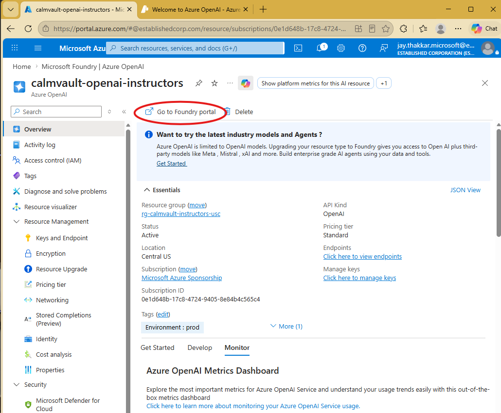
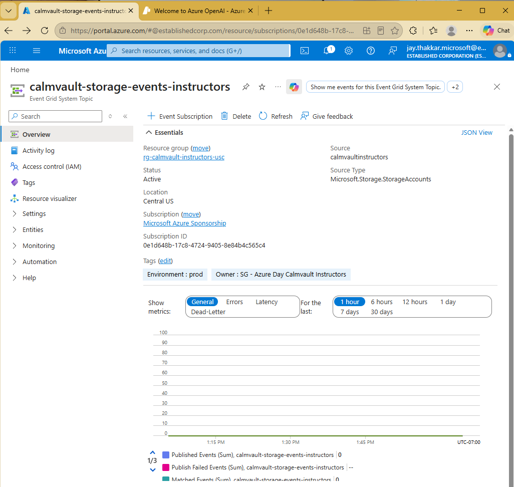
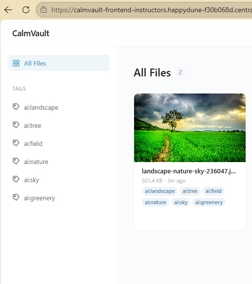

# Activity 5 — AI Auto-Tagging (Optional)

This optional activity adds an AI-powered service that automatically tags uploaded files using Azure OpenAI GPT-4o. When a file is uploaded, Event Grid triggers the tagger Container App Job which analyzes the content and adds `ai:`-prefixed tags to the Cosmos DB document.

> **Prerequisites:** Activities 1–3 must be deployed. Azure OpenAI access must be available on your subscription.

## 5.1 Build and Push the Tagger Image

**Bash:**

```bash
az acr build \
  --registry calmvaultacr$SUFFIX \
  --image calmvault-tagger:latest \
  --file activity-5/tagger/Dockerfile .
```

**PowerShell:**

```powershell
az acr build `
  --registry "calmvaultacr$SUFFIX" `
  --image calmvault-tagger:latest `
  --file activity-5/tagger/Dockerfile .
```

## 5.2 Deploy Infrastructure

**Bash:**

```bash
az deployment group create \
  --resource-group $RG_NAME \
  --template-file activity-5/infrastructure/main.bicep \
  --name activity5-ai-tagger
```

**PowerShell:**

```powershell
az deployment group create `
  --resource-group $RG_NAME `
  --template-file activity-5/infrastructure/main.bicep `
  --name activity5-ai-tagger
```

> **Tip:** This deploys Azure OpenAI with a GPT-4o model, an Event Grid system topic, a Storage Queue, and the tagger Container App Job. It may take 2–3 minutes.

## 5.3 Verify

1. Navigate to your resource group in the Azure Portal
2. Confirm the **Azure OpenAI** resource (`calmvault-openai-<suffix>`) exists with a `gpt-4o` deployment
3. Check the **Storage Account** → **Queues** — you should see a `blob-events` queue
4. Open **Event Grid System Topics** — confirm `calmvault-storage-events-<suffix>` has a subscription
5. Check **Container App Jobs** — `calmvault-tagger-<suffix>` should exist (no active executions when idle)





## 5.4 Test Auto-Tagging

1. Upload an image or text file through the CalmVault frontend
2. Wait 30–60 seconds for the tagger to process the event
3. Refresh the file in the frontend — you should see `ai:`-prefixed tags (e.g., `ai:landscape`, `ai:document`)



> **Note:** The tagger scales from 0, so the first event may take longer while the container starts up. Subsequent events are faster.

---

👉 **Next:** [Activity 6 — Cleanup]({{ 'activity-6.html' | relative_url }})
