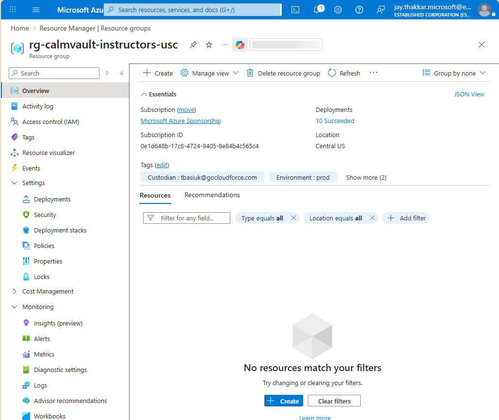

# Activity 6 — Cleanup

When you're finished with the lab, delete all Azure resources to avoid ongoing charges.

> ⚠️ **This is irreversible.** All uploaded files, database records, container images, and telemetry data will be permanently deleted. Download anything you want to keep before proceeding.

## 6.1 Remove Resources from the Resource Group

This deployment runs an empty Bicep template in **Complete** mode, which removes every Azure resource created across Activities 1–5 while keeping the resource group itself:

**Bash:**

```bash
az deployment group create \
  --resource-group $RG_NAME \
  --template-file activity-6/empty.bicep \
  --mode Complete \
  --name activity6-cleanup
```

**PowerShell:**

```powershell
az deployment group create `
  --resource-group $RG_NAME `
  --template-file activity-6/empty.bicep `
  --mode Complete `
  --name activity6-cleanup
```

> **What just happened?** Azure compared the resource group to an empty template and deleted the resources that were no longer declared. This cleanup typically takes a few minutes.

## 6.2 Purge Soft-Deleted Azure OpenAI (Optional)

If you completed Activity 5, the Azure OpenAI account enters a 48-hour soft-delete period after cleanup. Purge it immediately if you plan to re-run the lab or need to free up quota:

**Bash:**

```bash
az cognitiveservices account purge \
  --name calmvault-openai-$SUFFIX \
  --resource-group $RG_NAME \
  --location centralus
```

**PowerShell:**

```powershell
az cognitiveservices account purge `
  --name "calmvault-openai-$SUFFIX" `
  --resource-group $RG_NAME `
  --location centralus
```

> **Tip:** Run the purge command after the cleanup deployment finishes. It uses `$RG_NAME` to reference the original Azure OpenAI resource metadata while the soft-deleted account is being purged.

## 6.3 Verify Cleanup

After a few minutes, confirm the resource group is empty:

**Bash / PowerShell:**

```bash
az resource list --resource-group $RG_NAME --output table
# Expected: empty list (no resources)
```



---

## Congratulations! 🎉

You've completed the CalmVault deployment lab. Here's what you built and learned:

| Activity | What you did | Skills practiced |
| --- | --- | --- |
| 1 | Deployed Azure infrastructure and ran the app locally | Bicep, Azure Storage, Cosmos DB |
| 2 | Built container images in the cloud | Docker, Azure Container Registry |
| 3 | Deployed to Azure Container Apps | Managed containers, auto-scaling, secrets |
| 4 | Added monitoring and observability | Diagnostic settings, Log Analytics, Application Insights |
| 5 | Added AI auto-tagging (optional) | Azure OpenAI, Event Grid, Container App Jobs |
| 6 | Cleaned up all resources | Resource lifecycle management |
